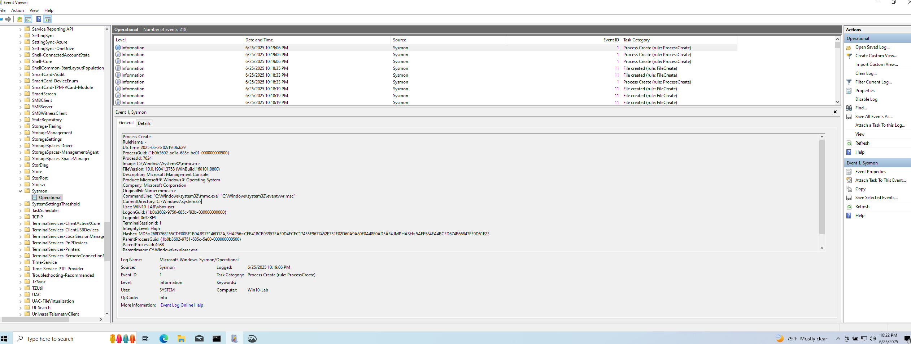

# Incident 001 – Suspicious MMC.exe Execution

**Date:** 2025-06-25  
**Source:** Sysmon Event ID 1 (Process Create)

## 🧾 Summary
A suspicious execution of `mmc.exe` was detected. Although mmc.exe is a legitimate Windows utility, attackers may use it to load malicious snap-ins or run commands via Event Viewer.

## 📸 Evidence

## 🔍 Analysis
- **Image:** `C:\Windows\System32\mmc.exe`
- **CommandLine:** `"mmc.exe" "C:\Windows\system32\eventvwr.msc"`
- **User:** `vboxuser`
- **Hash:** SHA256...

## 🔗 MITRE ATT&CK Mapping
- **T1059** – Command and Scripting Interpreter
- **T1003** – OS Credential Dumping (if mmc is used with plugins)

## 🛡️ Recommendation
Investigate further if the MMC snap-in used is not common. Apply endpoint restrictions and log parent-child process relationships.
